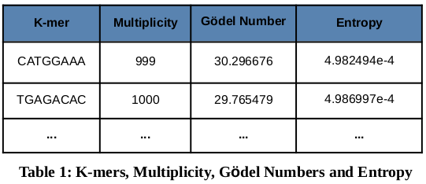
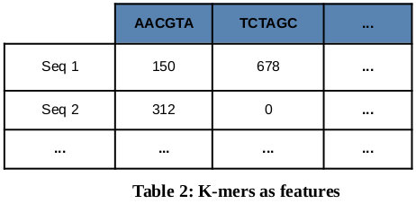

# ELIXIR BioHackathon 2020 - Project 39

The ELIXIR BioHackathon 2020 was a virtual event that took place from 9th to 13th of November. Overall, the event involved forty one projects; through Project #39 "[Unlock the value of your data computing at the edge](https://www.biohackathon-europe.org/projects.html)" participants were provided access to ATOS Edge computing, in order to assess its applicability and relevance towards addressing challenges for the analysis of biological Big Data. Our team, representing the [BioData Analysis Group](https://biodataanalysisgroup.github.io/), at [INAB](https://inab.certh.gr/)|[CERTH](https://www.certh.gr/), used the offered resources to evaluate the performance and overall suitability of ATOS Edge in the context of our work on k-mer-based models of sequence data, towards facilitating the application of Machine Learning methods.

The first part of our work was based on gödel encoding, a process that uses Gödel numbers in order to create a unique numerical representation of each nucleotide sequence ([preprint](https://arxiv.org/abs/1909.13574)). The target dataset consisted of approximately 13.000 SARS-CoV-2 sequences ([URL](https://www.ncbi.nlm.nih.gov/sars-cov-2/)) and the analysis stage included the construction of k-mer matrices (Table 1). For a fixed value of k, we calculated the multiplicity of every single identified k-mer within the input dataset, as well as the corresponding gödel number and its relative entropy. The analysis was conducted for a range of k values, from k=4 tok=100. The size of output files grows linearly with respect to k, starting from ~100 KB and up to ~200 MB. Finally, the execution time on the provided resources ranged between 6 and 8 hours.

Additionally, and for a given value of k, we counted the k-mers per sequence (Table 2), with the aim of using the k-mer as potential features in a machine earning process. In the test case, the output comprised 29 matrices, one for each  k value in the range [4,32], with the output size increasing linearly, from ~11 MB to ~4.1 GB. The execution time was estimated to be around 26-30 hours, with an average value of 28 hours

## Subsection level 2

Please keep sections to a maximum of three levels, even better if only two levels.

### Subsection level 3

Please keep sections to a maximum of three levels.

## Tables, figures and so on

Please remember to introduce tables (see Table 1) before they appear on the document. We recommend to center tables, formulas and figure but not the corresponding captions. Feel free to modify the table style as it better suits to your data.

Table 1
| Header 1 | Header 2 |
| -------- | -------- |
| item 1 | item 2 |
| item 3 | item 4 |

Remember to introduce figures (see Figure 1) before they appear on the document. 

 
Figure 1. A figure corresponding to the logo of our BioHackrXiv preprint.

# Other main section on your manuscript level 1

Feel free to use numbered lists or bullet points as you need.
* Item 1
* Item 2

# Discussion and/or Conclusion

We recommend to include some discussion or conclusion about your work. Feel free to modify the section title as it fits better to your manuscript.

# Future work

And maybe you want to add a sentence or two on how you plan to continue. Please keep reading to learn about citations and references.

For citations of references, we prefer the use of parenthesis, last name and year. If you use a citation manager, Elsevier – Harvard or American Psychological Association (APA) will work. If you are referencing web pages, software or so, please do so in the same way. Whenever possible, add authors and year. We have included a couple of citations along this document for you to get the idea. Please remember to always add DOI whenever available, if not possible, please provide alternative URLs. You will end up with an alphabetical order list by authors’ last name.

# Jupyter notebooks, GitHub repositories and data repositories

* Please add a list here
* Make sure you let us know which of these correspond to Jupyter notebooks. Although not supported yet, we plan to add features for them
* And remember, software and data need a license for them to be used by others, no license means no clear rules so nobody could legally use a non-licensed research object, whatever that object is

# Acknowledgements
Please always remember to acknowledge the BioHackathon, CodeFest, VoCamp, Sprint or similar where this work was (partially) developed.

# References

Leave thise section blank, create a paper.bib with all your references.
